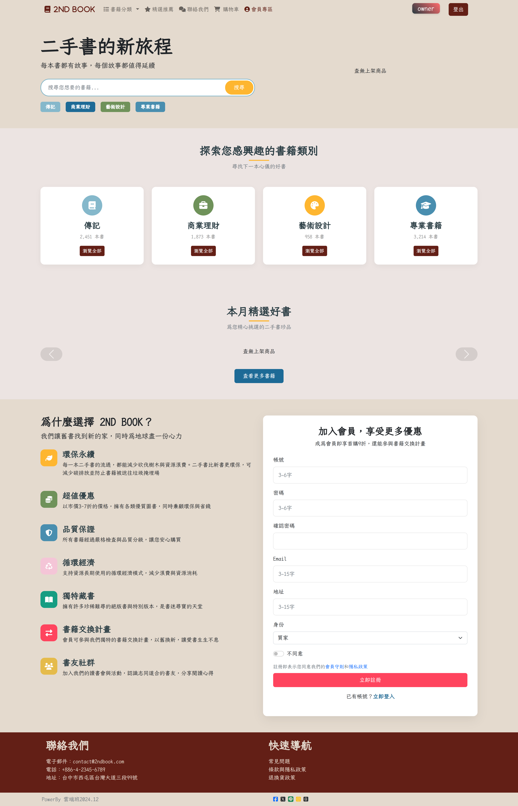
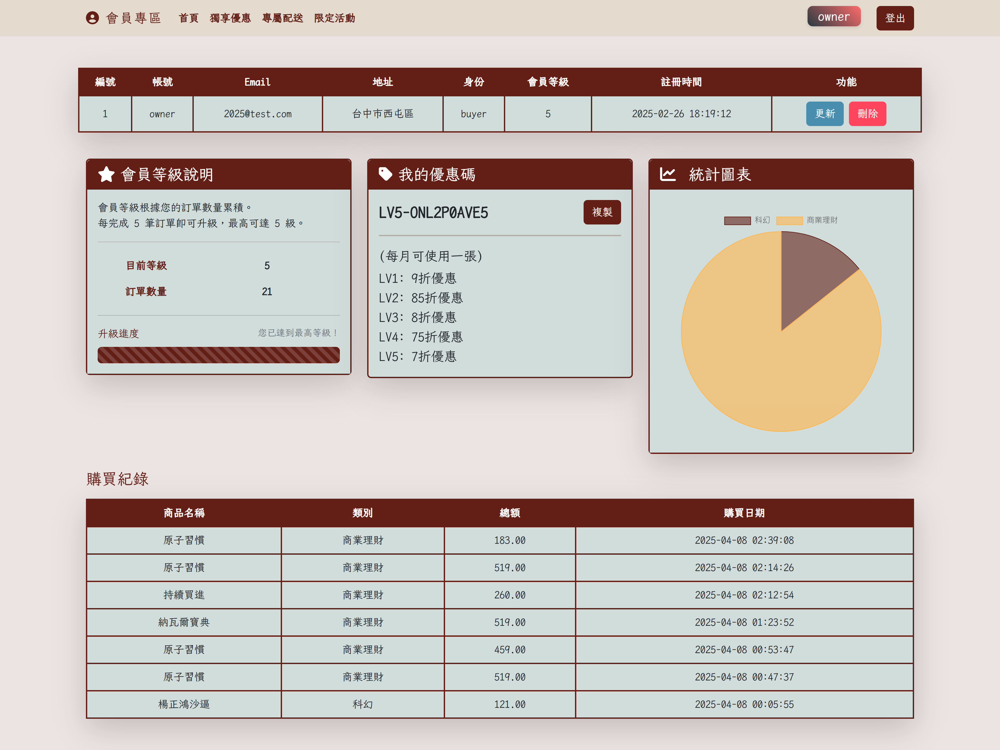
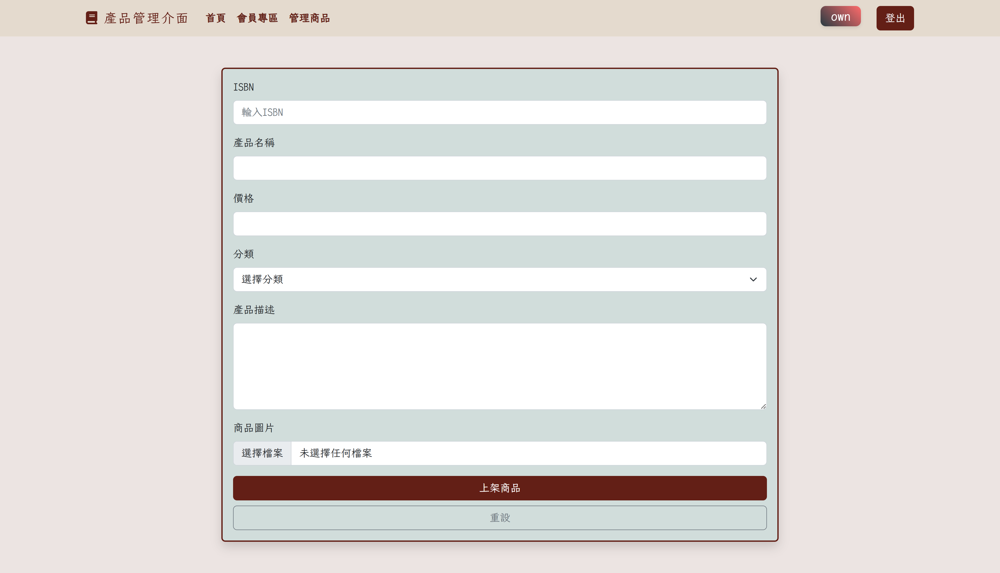

---

# 2nd BOOK - 二手書交易網站

本專案是一個以二手書交易為核心的網站，提供會員登入、商品上架、商品瀏覽、購物車、結帳與訂單完成等完整購物流程，同時根據會員等級推展專屬配送與優惠服務。前端部分主要採用 HTML5、CSS3（搭配 Bootstrap、Animate.css 與 Font Awesome）、jQuery 與 SweetAlert2；後端則以 PHP 撰寫 API 與資料庫進行資料交換。

---

## 目錄

- [專案簡介](#專案簡介)
- [各頁面功能說明](#各頁面功能說明)
  - [會員系統與登入](#會員系統與登入)
  - [商品管理與產品建檔](#商品管理與產品建檔)
  - [商品展示與查詢](#商品展示與查詢)
  - [購物車與結帳流程](#購物車與結帳流程)
  - [專屬配送與優惠](#專屬配送與優惠)
  - [會員中心](#會員中心)
  - [訂單完成頁面](#訂單完成頁面)
- [技術與程式語法](#技術與程式語法)
  - [前端技術與設計](#前端技術與設計)
  - [後端 API 與 PHP](#後端-api-與-PHP)
  - [外部函式庫與 API 整合](#外部函式庫與-API-整合)
- [後續擴充計畫](#後續擴充計畫)
- [參考圖](#參考圖)

---

## 專案簡介

本平臺專注於二手書交易，無論用戶搜尋喜愛書籍、賣家上架新商品或會員享有專屬優惠，系統均以直覺易用、現代化的介面呈現。系統涵蓋會員登入與資料管理、商品上架與管理、購物車與結帳流程，以及訂單完成確認，同時為高等級會員提供快速配送與專屬折扣等服務。

---

## 各頁面功能說明

### 會員系統與登入

- **登入介面**  
  提供使用者進入會員專區的登入介面，包括基本帳號與密碼欄位，並以直覺式設計與清晰提示訊息確保使用者輕鬆完成驗證。系統透過 API 進行身份驗證，成功登入後導向會員中心及相關專屬服務頁面。

### 商品管理與產品建檔

- **商品上架介面**  
  賣家可以透過友善的表單上架新商品，包含 ISBN、產品名稱、價格、分類、產品描述與圖片上傳功能。頁面支援即時圖片預覽，並整合 Google Books API 自動填入書籍資料（如書名、作者、出版日期與封面圖片），簡化上架流程並確保資料正確。
  
- **後台商品管理**  
  管理端提供完整的商品清單展示，清楚列出商品編號、名稱、價格、分類、上傳日期與操作按鈕（編輯、刪除），讓賣家能快速管理上架商品。

### 商品展示與查詢

- **商品列表與篩選**  
  以卡片方式展示所有商品，包含書本封面、商品名稱、作者、價格與簡介。使用者可依分類進行篩選，頁面搭配滑鼠懸停效果與動畫，提供流暢且美觀的瀏覽體驗。

### 購物車與結帳流程

- **購物車功能**  
  用戶可將心儀商品加入購物車，隨時檢視商品圖片、名稱、數量與價格，並支援動態刪除與總金額計算。彈性排版確保各裝置上皆有良好顯示效果。

- **結帳流程**  
  結帳頁面提供詳細產品明細、配送地址與付款方式輸入欄位，並搭配步驟指示顯示流程進度。欄位聚焦效果及即時表單驗證確保用戶順利提交資料。

### 專屬配送與優惠

- **專屬配送功能**  
  為高等級會員提供快速提貨或專屬配送服務，頁面內嵌地圖功能，讓用戶可直覺性選擇所在縣市與鄉鎮區，同時輸入詳細地址。操作介面設計直觀且具備重設與確認功能。
  
- **優惠碼與專屬折扣**  
  會員專區中呈現依據會員等級所對應的優惠碼，享有從9折至7折不等的購物優惠，並提供一鍵複製功能，方便用戶在購物時快速使用優惠。

### 會員中心

會員中心作為整個系統的重要互動介面，主要功能包括：

- **會員資料展示**  
  用表格清楚呈現會員的編號、帳號、Email、地址、身份、會員等級與註冊時間。資料將以動態方式載入，確保資訊即時更新。

- **資料更新功能**  
  提供 Modal 視窗讓會員更新其 Email 與地址。系統對欄位進行即時驗證，更新後透過 API 將最新資料同步到後端，確保用戶資訊正確無誤。

- **會員等級與優惠展示**  
  根據會員訂單數量自動計算會員等級，並以進度條顯示升級進度。會員中心直觀展示優惠資訊和專屬折扣，同時提供複製優惠碼的功能，方便用戶在後續購物中享用優惠。

- **統計圖表與購買紀錄**  
  若會員身份為買家，系統會額外展示購買紀錄，並根據購買數據產生統計圖表，讓會員能夠直觀了解自己的消費行為；若會員為賣家，則呈現銷售統計與相關數據圖表，協助其管理業績。

### 訂單完成頁面

- **訂單確認與詳細資訊**  
  訂單完成頁面提供訂單編號、商品明細、配送與付款資訊等確認內容，搭配成功提示圖示與動畫效果，讓用戶在完成訂單後獲得正面且清晰的回饋。

---

## 技術與程式語法

### 前端技術與設計

- **HTML5 與語意化標籤**  
  全站均採用 HTML5 標準與語意化標籤（如 header、section、nav）組織內容，以提升結構清晰度與 SEO 效果。

- **CSS3 與 Bootstrap**  
  透過自訂 CSS 變數（例如主題色）搭配 Bootstrap 框架，實現響應式設計與一致視覺風格；Animate.css 提供流暢動畫效果，增強用戶互動體驗。

- **jQuery 與 SweetAlert2**  
  使用 jQuery 簡化 DOM 操作與 Ajax 請求，例如在商品上架頁面中實作圖片預覽及自動填入書籍資訊。SweetAlert2 則用於彈出精美提示，增強用戶操作回饋。

### 後端 API 與 PHP

- **PHP API 實作**  
  後端 API 以 PHP 編寫，負責處理會員登入、資料更新、商品 CRUD 與訂單管理，採用 JSON 格式進行資料傳輸與錯誤處理，確保前後端資料交換流暢。

- **資料庫安全連線**  
  系統連接 MySQL 等資料庫，並加強請求驗證以防範 SQL Injection 等攻擊，確保系統安全穩定。

### 外部函式庫與 API 整合

- **Google Books API**  
  在上架商品時，透過 ISBN 自動獲取書籍資訊（如書名、作者、出版日期與封面圖片），大幅簡化賣家上架流程。

- **Google Maps API**  
  在專屬配送頁面中嵌入地圖，提供地址定位與選擇服務，讓用戶能夠精準輸入配送地址。

- **其他函式庫**  
  使用 Font Awesome 提供視覺一致的圖示資源，結合 Animate.css 與 Bootstrap，打造現代化且互動豐富的使用者介面。

---

## 後續擴充計畫

- **社交與互動升級**  
  探索會員間互動功能，如留言、評價與推薦系統，進一步提升用戶黏著度。

- **智能推薦系統**  
  基於用戶瀏覽與購買紀錄，導入推薦演算法，自動推送相關商品，增強購物體驗。

- **移動端優化**  
  加強手持裝置版面調整與觸控互動，確保在行動裝置上也能獲得優異的瀏覽體驗。

- **後台數據分析**  
  為賣家與管理員擴展更進階的銷售統計、庫存管理與自動通知系統，提升後台運營效率。

---

## 參考圖

<ul style="list-style: none; padding: 0; display: flex; justify-content: space-evenly;">
  <li>
    
    
首頁截圖

  </li>
  <li>
    
    
會員中心截圖

  </li>
  <li>
    
    
商品上架截圖

  </li>
</ul>

---
